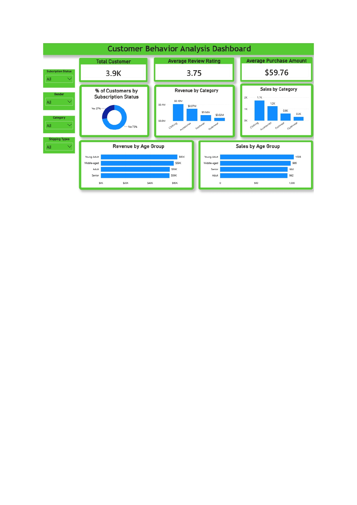

# customer_shopping_behavior_analysis-project
End-to-end data analytics project using Python, MySQL, and Power BI to analyze customer shopping behavior and generate actionable business insights.

## Project Overview

Retail businesses generate large volumes of customer transaction data every day. This project analyzes customer purchasing behavior to uncover spending patterns, customer segments, and product performance, enabling data-driven business decisions.

---

## Business Objective

Analyze customer shopping behavior to identify purchasing patterns and generate actionable business insights.

---

## Dataset Information

- **Dataset:** Customer Shopping Trends
- **Source:** Kaggle
- **Records:** 3,900 Customer Transactions
- **Features:** 18 Variables

### Main Variables

- Customer ID
- Age
- Gender
- Category
- Item Purchased
- Purchase Amount
- Review Rating
- Shipping Type
- Subscription Status
- Discount Applied
- Previous Purchases

---
## Tech Stack

| Tool | Purpose |
|------|---------|
| Python (Pandas) | Data Cleaning & Feature Engineering |
| MySQL | Data Storage & SQL Analysis |
| Power BI | Dashboard & Data Visualization |

---

## Project Workflow
```text
Raw Dataset (.csv)
        ↓
Data Cleaning (Python)
        ↓
Feature Engineering
        ↓
MySQL Database
        ↓
SQL Business Analysis
        ↓
Power BI Dashboard
        ↓
Business Insights
```

---
## Data Preparation

The dataset was prepared using Python by performing:

- Handling missing values using median imputation by product category.
- Renaming columns using snake_case.
- Creating **Age Group** for customer segmentation.
- Converting purchase frequency into numerical day values.
- Removing redundant columns.
- Exporting the cleaned dataset to MySQL.

---

## SQL Analysis

The project answers ten business questions using SQL.
| Query | Business Question |
|------|----------------|
| Q1 | Revenue by gender |
| Q2 | High-value customers using discounts |
| Q3 | Top-rated products |
| Q4 | Average purchase by shipping type |
| Q5 | Subscriber vs Non-subscriber spending |
| Q6 | Products with highest discount usage |
| Q7 | Customer segmentation |
| Q8 | Top-selling products by category |
| Q9 | Repeat buyer subscription analysis |
| Q10 | Revenue contribution by age group |

SQL techniques used:

- GROUP BY
- Aggregation Functions
- Subqueries
- CASE WHEN
- Common Table Expressions (CTE)
- Window Functions

---
## Dashboard Preview

```


---

## Key Findings
- Young Adults generated the highest revenue (~$62K).
- Clothing was the highest-performing product category.
- Only 27% of customers subscribed to the membership program.
- Subscribers showed higher average spending than non-subscribers.
- Average purchase amount reached $59.76.
- Average customer review rating was 3.75/5.

---

## Business Recommendations

- Expand subscription benefits to improve customer retention.
- Prioritize marketing campaigns for Clothing products.
- Develop personalized promotions for Young Adult customers.
- Improve customer experience to increase review ratings.
- Maintain inventory for high-demand products.

---

## Repository Structure

```
customer-shopping-behavior-analysis
│
├── dashboard/
│   ├── Customer_Behavior_Dashboard.pbix
│   └── dashboard.png
│
├── dataset/
│   └── customer_shopping_behavior.csv
│
├── notebooks/
│   └── customer_behavior_analysis.ipynb
│
├── sql/
│   └── customer_behavior_queries.sql
│
├── presentation/
│   └── Customer_Behavior_Analysis.pdf
│
├── images/
│   └── workflow.png
│
└── README.md
```
---

## Skills Demonstrated

- Data Cleaning
- Feature Engineering
- SQL Query Development
- Data Visualization
- Dashboard Design
- Business Analysis
- Data Storytelling

---
